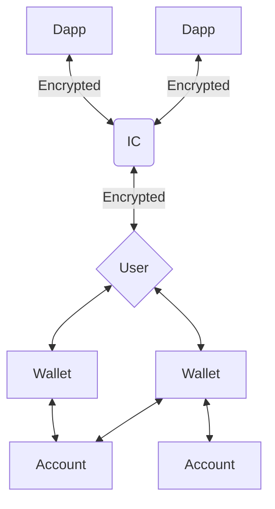

# Identity Connect Docs

This is a public repository for Identity Connect, that will contain docs, examples and source code for the SDKs.

For SDK specific docs, please refer to the following links:

- [Wallet SDK Docs](packages/wallet-sdk/DOCS.md)
- [Dapp SDK Docs](packages/dapp-sdk/DOCS.md)

Seperaetly, see dashboard staging [here](https://identity-connect.staging.gcp.aptosdev.com/)  

This monorepo uses `turborepo`.

## Getting started

1. Install `node.js`
2. Clone the repo
3. run `yarn install` from the root directory

## Examples

Under the `/examples` folder you can find an example wallet and an example dapp, to use as reference
for adopting the IC SDK in your application.

## Packages

- `eslint-config`: `eslint` configurations
- `tsconfig`: `tsconfig.json`s used throughout the monorepo

## Why Identity Connect?

In Web2, platforms like Google and Steam help connect users and their identities to their applications. Web3 traditionally has avoided identity management services and empowers users to own their identity via decentralized identity platforms such as self-custodial wallets and other identity management platforms. As a user interacts with an application on one device, their identity may be managed on another. This inherently creates a challenge for enabling seamless identity integration within an application. To address this, we propose ************************************Identity Connect*******************,***************** to be used as a platform, and protocol for coordinating across identity services and applications.

**Identity Connect has the following properties**:

- A core protocol for routing requests from applications to identity providers that allow for proof of identity and signing transactions.
- A platform for managing persistent connections across applications and identity services, e.g., wallets and custodial solutions.
- Leverage existing identity solutions, such as OAuth, for coordination across user interfaces. This allows users to login from the application, identity services, or a dedicated front-end to establish and manage connections.

## Overview

Identity Connect is a stateful service allowing asynchronous communication between dApps (desktop, mobile, browser) and wallets (custody, mobile, chrome extensions). Having a permanent stateful server as the relay between dApp and wallet allows Identity Connect to avoid any pitfalls of dropping requests and allows us to extend this to not only self-custody wallets but even identity brokering (’login with IC’), MPC, and custody services in the future.

**Identity Connect V1** allows two ways to create a pairing between a dApp and a Wallet:

1. **Anonymous pairing** (via QR Code)
    1. Enables users to connect an application with their wallet (most likely a mobile wallet) without registering their identity via OAuth. All transaction requests and payloads will be end-to-end encrypted to ensure privacy.
2. **Connected pairing** (via OAuth)
    1. Users who opt-in can use their OAuth identity (like Google Sign-in) to store the identities and applications they’ve connected with, across all devices. This effectively avoids users needing to re-register their wallets with their applications after the initial connection.
    2. The advantages of this are as follows:
        1. The first time a user connects an application with their wallet, they will need a QR code or link to register the wallet on their mobile device with that application. 
        2. When a user revisits the application in the future, transaction signing notifications can be automatically sent to their device without having to scan a QR code again to register a connection.

**The user flow** for connecting and sending transactions from a dApp will look like this:

1. Dapp presents an [OAuth](https://en.wikipedia.org/wiki/OAuth) prompt (”Sign-in with Gmail” or another OAuth provider) to sign into Identity Connect.
2. User selects an existing account attached to their Identity Connect. They must connect a wallet if this is their first time using Identity Connect.
3. The selected wallet receives a notification and prompts the user to “Connect” to the dApp.
4. The dApp can now send transactions to Identity Connect, which will be routed to the wallet to be signed by the user. Users can get signing notifications (”notifications to sign a transaction”) for the same account in multiple wallets thanks to the Identity-Connect (IC) abstraction around accounts. It is sufficient for a wallet to prove it has control over a private key to start getting notifications for that account.

## Other Technical Details
To read more about technical design, go to [Technical Design](Technical_Design.md)
  
